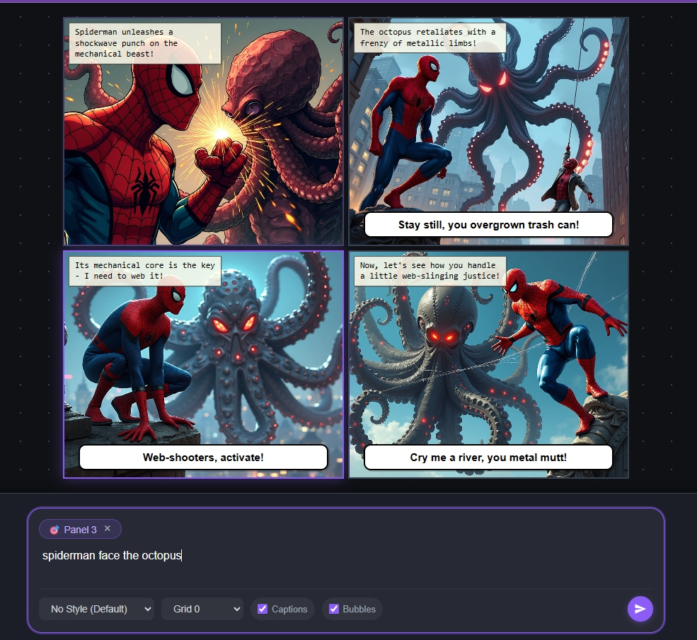
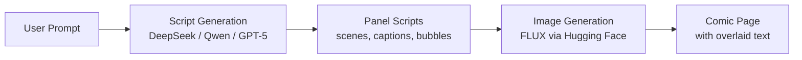

# 🦸 AI Comic Book Generator

An AI-powered web application that generates full comic book pages from simple text descriptions. Type a scene, pick a style, and watch AI create stunning comic panels complete with artwork, speech bubbles, captions, and dynamic layouts — all in seconds.



## ✨ Features

- **🎨 AI-Powered Panel Generation** — Generates vivid comic book panels from text prompts using state-of-the-art image models (FLUX.1-dev / FLUX.2-dev-Turbo)
- **📝 Smart Script Generation** — Uses LLMs (DeepSeek R1, Qwen, or GPT-5) to create panel scripts with scene descriptions, narration, captions, and speech bubbles
- **🧑‍🎨 Multiple Art Styles** — Choose from different visual styles for your comic panels
- **📐 Flexible Grid Layouts** — Multiple layout options including 2x2 grids, asymmetric layouts, and more
- **💬 Speech Bubbles & Captions** — Auto-generated dialogue and narration overlaid on panels
- **🔄 Per-Panel Regeneration** — Don't like a panel? Add a comment and regenerate just that one
- **💾 Persistent Images** — Generated panels are saved to disk so they survive page refreshes
- **🎭 Character Consistency** — Advanced prompting ensures the main character looks consistent across all panels
- **🌙 Dark Theme UI** — Sleek, modern dark interface with purple accents and particle effects

## 🛠️ Tech Stack

| Layer | Technology |
|-------|-----------|
| **Framework** | [Next.js 16](https://nextjs.org/) (App Router) |
| **Frontend** | React 19, TypeScript, Tailwind CSS |
| **Animations** | Framer Motion |
| **Script Generation** | DeepSeek R1, Qwen, GPT-5.2 (via OpenAI / Hugging Face APIs) |
| **Image Generation** | FLUX.1-dev / FLUX.2-dev-Turbo (via Hugging Face Inference) |
| **Character Analysis** | OpenAI Vision API |

## 🚀 Getting Started

### Prerequisites

- **Node.js** 18+
- **Hugging Face API Token** — for image generation ([get one here](https://huggingface.co/settings/tokens))
- **OpenAI API Key** *(optional)* — for GPT-5 script generation and character analysis

### Installation

1. **Clone the repository**
   ```bash
   git clone https://github.com/TDMD2/AICommit.git
   cd AICommit
   ```

2. **Install dependencies**
   ```bash
   npm install
   ```

3. **Configure environment variables**

   Create a `.env.local` file in the root directory:
   ```env
   HF_TOKEN=your_huggingface_token_here
   OPENAI_API_KEY=your_openai_api_key_here   # Optional
   IMAGE_MODEL=FLUX.1-dev                     # Or FLUX.2-dev-Turbo
   ```

4. **Start the development server**
   ```bash
   npm run dev
   ```

5. **Open** [http://localhost:3000](http://localhost:3000) **in your browser**

## 📖 How It Works



1. **You describe a scene** — e.g. *"Spiderman faces the octopus"*
2. **An LLM writes the script** — breaking it into panels with scene descriptions, narration, and dialogue
3. **FLUX generates the artwork** — each panel gets a detailed image prompt with style and character info
4. **The app composes the page** — panels are arranged in your chosen grid layout with speech bubbles and captions overlaid

## 📂 Project Structure

```
comic-book-app/
├── src/
│   ├── app/
│   │   ├── api/generate/route.ts   # Backend: script + image generation
│   │   ├── page.tsx                # Main page
│   │   └── globals.css             # Global styles
│   ├── components/
│   │   ├── ComicBook.tsx           # Comic book viewer
│   │   ├── ComicCanvas.tsx         # Canvas rendering
│   │   ├── ComicPage.tsx           # Individual page layout
│   │   ├── CreateComic.tsx         # Creation form + prompt input
│   │   ├── LoadingScreen.tsx       # Loading animations
│   │   ├── Particles.tsx           # Background particle effects
│   │   └── Sidebar.tsx             # Navigation sidebar
│   ├── data/storyData.ts           # Story templates
│   └── types/comic.ts              # TypeScript interfaces
├── public/panels/                  # Saved generated images
└── package.json
```

## 📄 License

This project is for educational and personal use.

---

<p align="center">
  Built with ❤️ using Next.js, React, and AI
</p>
